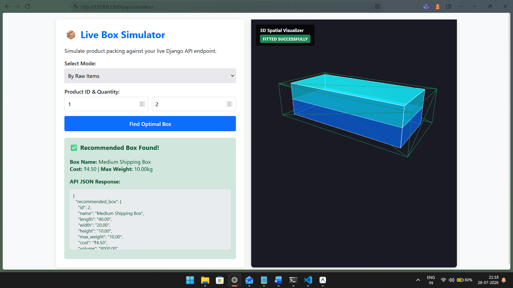

Markdown

# AI-Assisted Box Selection System

A robust Django and Django REST Framework (DRF) backend service that automatically determines the most cost-effective shipping box for customer orders based on physical dimensions, volumetric constraints, weight capacity, and 3D rotational fitting algorithms.

---

## Features

- **Automated Box Recommendation Engine**: Evaluates candidate boxes against total weight limits, aggregate volumes, and multi-item dimensional/stacking constraints.
- **3D Rotational Fit Validation**: Normalizes and sorts item and container dimensions to ensure products fit regardless of orientation.
- **Flexible API Endpoints**: Support for both database-persisted `order_id` lookups and transient raw item payloads.
- **Precise Data Integrity**: Leverages `DecimalField` and `MinValueValidator` across all models to eliminate floating-point calculation inaccuracies.

---

## Tech Stack

- **Python** (v3.10+)
- **Django** (v6.0+)
- **Django REST Framework (DRF)**
- **SQLite** (Default development database)

---

## Project Structure

```text
box-selection-system/
│
├── box_selection_system/       # Project configuration settings & URL routing
│   ├── __init__.py
│   ├── settings.py
│   ├── urls.py
│   ├── wsgi.py
│   └── asgi.py
│
├── box_app/                    # Core business logic app
│   ├── migrations/             # Database migrations
│   ├── models.py               # Product, Box, Order, and OrderItem schemas
│   ├── templates/              # HTML templates for simulator
|   ├── serializers.py          # DRF API Serializers & validation rules
│   ├── services.py             # Box recommendation & 3D fit algorithm
│   ├── views.py                # API endpoints and simulator views
│   ├── urls.py                 # App-level URL routing
│   └── tests.py                # Automated unit & integration tests
│
├── manage.py                   # Django management script
├── requirements.txt            # Project Python dependencies
├── AI_USAGE.md                 # AI collaboration and prompt log
└── README.md                   # Project documentation

Installation & Setup Guide

Follow these steps to set up and run the project locally on your machine.
1. Prerequisites

Ensure you have Python (version 3.10 or higher) and pip installed on your system.
2. Clone or Extract the Project

Navigate to your project directory where the source code is located:
Bash

cd path/to/box-selection-system

3. Create and Activate a Virtual Environment

It is recommended to run the project inside an isolated virtual environment:
Bash

# Create virtual environment
python -m venv venv

# Activate virtual environment
# On Windows (CMD):
venv\Scripts\Activate
# On macOS/Linux:
source venv/bin/activate

4. Install Dependencies

Install the required packages using requirements.txt:
Bash

pip install -r requirements.txt

5.

5. Apply Database Migrations

Initialize the SQLite database schema by running migrations:
Bash

python manage.py makemigrations
python manage.py migrate

6. Run the Development Server

Start the local Django development server:
Bash

python manage.py runserver

The application will be accessible at http://127.0.0.1:8000/.
API Documentation & Endpoints

You can interact with the endpoints using tools like Postman, cURL, or the Django REST Framework browsable web interface (http://127.0.0.1:8000/api/).
1. Recommend Box

    URL: http://127.0.0.1:8000/api/recommend-box/

    Method: POST

    Description: Evaluates an order or raw list of items and returns the optimal cost-effective box.

Payload Option A (By Stored Order ID):
JSON

{
  "order_id": 1
}

Payload Option B (By Raw Item List):
JSON

{
  "items": [
    {
      "product_id": 1,
      "quantity": 2
    }
  ]
}

Successful Response (200 OK):
JSON

{
  "recommended_box": {
    "id": 2,
    "name": "Medium Shipping Box",
    "length": "40.00",
    "width": "20.00",
    "height": "10.00",
    "max_weight": "10.00",
    "cost": "4.50"
  },
  "order_summary": {
    "total_weight": "2.00",
    "total_volume": "5250.00"
  }
}

Running Tests

To run the complete automated test suite (including model validation, recommendation service edge cases, and API endpoint tests):
Bash

python manage.py test


# 3D Spatial Simulator Dashboard

The project includes an interactive web dashboard for real-time visual inspection of how products fit inside recommended boxes.

    URL: http://127.0.0.1:8000/api/simulator/

    Features:

        Interactive camera controls (rotate, pan, zoom).

        Wireframe rendering of selected boxes alongside solid 3D representations of packed items.

        Live API testing form to input products/quantities and instantly render the spatial layout.

        